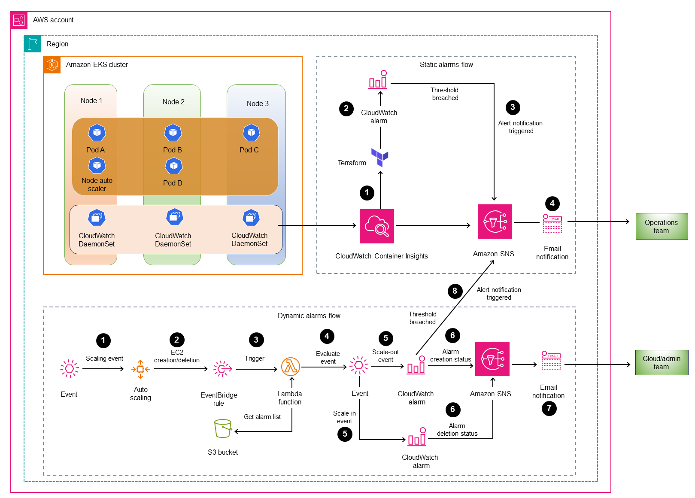

# eks-automated-monitoring
CloudWatch provides native solutions to setup alerting and monitoring solution for EKS cluster. This pattern describes and implements CloudWatch alert setup for EKS cluster leveraging Container Insight. Alerts for EKS cluster can be broadly divided into two categories.

### Static components:

Once EKS cluster is setup, There are system/application pods, daemonset etc. Identifier of these components remain static on cluster until explicitly updated. This pattern describes method to set CloudWatch alert using CloudWatch metrics and Terraform.

### Dynamic components:

EKS cluster has one or more EKS node group which has varying number of instances known as EKS nodes. There can be multiple EKS nodes depending on demand and handled by Auto Scaling Group. In the event of scale out, new node joins cluster whereas in the event of scale in redundant nodes get deleted. There are other events as well as EKS upgrade, Node patching where number of nodes change for an EKS cluster. CloudWatch metrics utilise instanceID as identifier for alert setup, list of instances (EKS Nodes) is dynamic and keep on changing during scaling event.

It is extremely important to have automated setup for CloudWatch alert for EKS nodes and requires custom solution to handle its dynamic nature. This pattern describes event-driven automated method to set CloudWatch alert for EKS nodes using CloudWatch metrics and Lambda.

# Prerequisites
- An active AWS account
- An AWS User/Role with sufficient permissions to provision resources using Terraform
- Terraform Cli
- AWS CLI
- kubectl
- git

# Product Versions
- Terraform v1.7.5
- Python 3.9
- EKS 1.28
- AWS CLI 2.11.1
- kubectl v1.28.8-eks-ae9a62a (EKS 1.28 compatible)

# Target Technology Stack
- AWS VPC, EKS
- AWS Lambda
- Amazon EventBridge
- Amazon SNS
- Amazon CloudWatch
    - Container Insights
    - CloudWatch Logs
    - CloudWatch Alarms
- Amazon S3
- AWS Identity and Access Management
- AWS Key Management Service

# Target architecture



# Automation and Scale
- This solution can be utilised to implement CloudWatch alert setup to multiple EKS clusters across various regions.

# Tools
- [Terraform](https://www.terraform.io/)
- [Cloudformation](https://docs.aws.amazon.com/cloudformation/)
- AWS services
    - [AWS Lambda](https://aws.amazon.com/lambda/)
    - [Amazon EventBridge](https://aws.amazon.com/eventbridge/)
    - [Amazon Simple Notification Service](https://aws.amazon.com/sns/)
    - [Amazon CloudWatch](https://aws.amazon.com/cloudwatch/)
    - [Amazon S3](https://aws.amazon.com/s3/)
    - [AWS Identity and Access Management (IAM)](https://aws.amazon.com/iam/)
    - [AWS Key Management Service](https://aws.amazon.com/kms/)

# Code
The code for this pattern is available in the automated-eks-monitoring Repository
```
https://github.com/aws-samples/eks-automated-monitoring.git
```

# Best Practices
- The IAM roles that are used to deploy this solution should adhere to the principle of least privilege. For more information, see the [IAM documentation](https://docs.aws.amazon.com/IAM/latest/UserGuide/best-practices.html#grant-least-privilege).

# Setup your environment
To pull down the repo
```
git clone https://github.com/aws-samples/eks-automated-monitoring.git 
```
This creates a folder named `eks-automated-monitoring`

## Deploy the infrastructure
This describes the steps to deploy the EKS Infra and CloudWatch alerts using combination of cloudformation and terraform.
- Refer the ./script/deploy to pass variables for terraform backend and role to provision the infrastructure

    Mandatory variables
    - SNS_EMAIL - Email Address to recieve alerts and notifications
    - TF_ROLE - IAM Role ARN has capabilities to launch resources into AWS account
    

- This solution will deploy the VPC and its components along with EKS private cluster in us-east-1 region. (You can update the parameters passed to these templates in `./script/deploy.sh` file
    1. To deploy, run below command
        ```
        ./scripts/deploy.sh -o apply
        ```
- Post completion of above script, Amazon SNS will send a subscription confirmation message to the given email address. 

    **To confirm a subscription**
    1. Check your email inbox and choose Confirm subscription in the email from Amazon SNS.

    2. Amazon SNS opens your web browser and displays a subscription confirmation with your subscription ID.

## Test and Verify the CloudWatch Alarm Setup
- Steps to verify alarms for static components
    1. Sign in to your AWS account, and open the AWS Management Console.
    2. Open to Amazon CloudWatch console and go to Alarms page.
    3. There should be bunch of alarms created based on the alarm list in terraform.tfvars file.
    4. Navigate to some of them and explore the configurations.
- Test creation/deletion of alarms for dynamic components
    To facilitate the dynamic creation or deletion of alarm nodes during scaling events, two potential scenarios exist.
    1. **Setting Up Alarms for Existing EKS Nodes:** If there are worker nodes already present before deploying this solution, you can use the following command to trigger the lambda function. This function will set up all alarms specified in the alarm list uploaded to an S3 bucket in JSON format for all EC2 instances.
    
    *Note: Lambda function name is printed in output of script ```deploy.sh``` executed in previous step.

    ```
    aws lambda invoke --function-name <Lambda function name> --invocation-type RequestResponse output
    ```
    
    *Note: Assume role with sufficient permission to trigger this command. Upon successful completion of above command, email notification will be sent to subscribed emails. Also, this can be verified from CW Alarms page.

    2. **Setting Up Alarms during auto scaling events:** This can be simulated or tested by increasing/Decreasing (ScaleIn/ScaleOut) the value of variable ```NUM_WORKER_NODES``` in file ```deploy.sh```. 
    Post change, run the below command.
        ```
        ./scripts/deploy.sh -o apply
        ```
        Alarm creation will occur upon Auto Scaling Group (ASG) successful launch or successful termination events. Following this, email notifications will be triggered to subscribed email addresses associated with topics ending with ```alarmSetupNotify```.
    3. Navigate to CloudWatch Alarm page in AWS console and verify all alarms details.

## Destroy the infrastructure
To destroy all the resources created by this solution, run below command.
```
./scripts/deploy.sh -o destroy
```

# Troubleshooting
-  Alarm Creation/Deletion Failures Or Notification emails not received
    1. If the CW alarms are not getting created or deleted, then go to AWS CloudWatch log group of lambda function and check for detailed error. Refer the doc for Accessing logs with the Lambda console

    2. Use lambda Monitoring to check various metrics graphs like Error count and success rate (%), Invocations to get details of lambda function execution rate. Refer the [doc](https://docs.aws.amazon.com/lambda/latest/dg/monitoring-functions-access-metrics.html) for navigation steps
